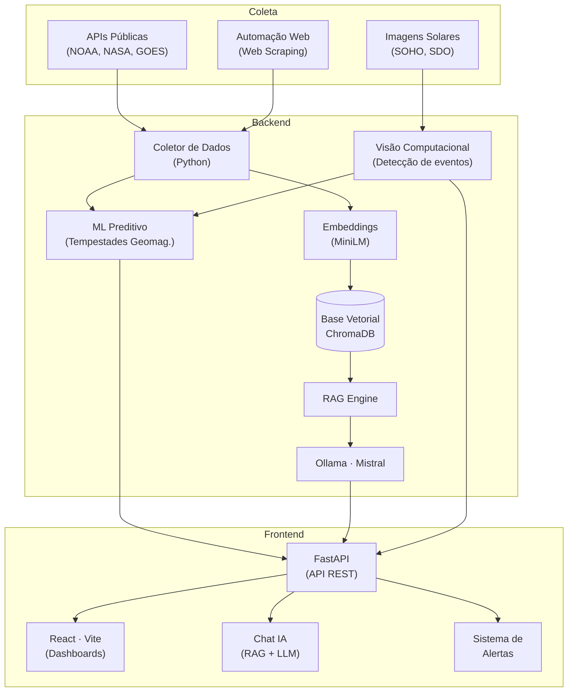

# Space Climate Monitor

<p align="center">
  <a href="https://www.fiap.com.br/"></a>
</p>

<p align="center">
  <strong>Monitoramento Inteligente do Clima Espacial</strong>
</p>

---

# Space Climate Monitor

Solução integrada de **monitoramento do clima espacial** que combina inteligência artificial, visão computacional, automação web e análise de dados em tempo real para prever e analisar fenômenos espaciais que impactam a Terra.

---

## Índice

- [Autor](#autor)
- [Sobre o projeto](#sobre-o-projeto)
- [Problema de negócio](#problema-de-negócio)
- [Solução](#solução)
- [Como funciona](#como-funciona)
- [Arquitetura](#arquitetura)
- [Tecnologias](#tecnologias)
- [Estrutura do repositório](#estrutura-do-repositório)
- [Pré-requisitos](#pré-requisitos)
- [Instalação e execução](#instalação-e-execução)
- [Interface web (React)](#interface-web-react)
- [API Backend](#api-backend)
- [Governança e Privacidade](#governança-e-privacidade)
- [Próximos Passos](#próximos-passos)

---

## Autor

**Space Climate Monitor — FIAP**

| Nome | RM | 
|------------|-----|
| <a href="https://www.linkedin.com/in/renanmendes26/">Renan de Oliveira Mendes</a> | RM563145 |

---

## Sobre o projeto

O **Space Climate Monitor** monitora, analisa e prevê fenômenos de clima espacial que podem afetar sistemas de comunicação, navegação por satélite, redes elétricas e operações espaciais na Terra.

Fenômenos como **tempestades solares**, **ejeções de massa coronal (CMEs)** e **ventos solares** podem causar:

- Interrupções em sinais de GPS e comunicações via satélite
- Sobrecargas em redes elétricas terrestres
- Riscos aumentados para astronautas e missões espaciais
- Degradação de componentes eletrônicos em satélites

O **Space Climate Monitor** processa dados em tempo real de múltiplas fontes — imagens solares (SOHO, SDO), sensores de campo magnético e estações de monitoramento — e aplica **Machine Learning**, **Visão Computacional** e **IA Generativa** para fornecer alertas preditivos, análises contextuais e visualizações interativas.

### Principais funcionalidades

| Funcionalidade | Descrição |
|----------------|-----------|
| **Monitoramento em tempo real** | Coleta e processa dados de agências espaciais (NOAA, NASA) via automação web |
| **Análise de imagens solares** | Visão computacional para detectar erupções solares e manchas no Sol |
| **Previsão com ML** | Modelos preditivos de tempestades geomagnéticas baseados em séries temporais |
| **Chat inteligente (RAG)** | Tire dúvidas sobre clima espacial em linguagem natural com respostas contextuais |
| **Dashboards interativos** | Visualização de dados históricos e em tempo real com React |
| **Alertas automáticos** | Notificações sobre eventos solares de alto impacto |

---

## Problema de negócio

O clima espacial é um dos **maiores riscos naturais para a infraestrutura tecnológica moderna**. A cada 11 anos o Sol atinge o pico de sua atividade (máximo solar), aumentando drasticamente a frequência e intensidade de eventos capazes de causar:

- **Prejuízos bilionários** em satélites e redes de comunicação
- **Apagões elétricos** em larga escala (ex: Quebec, 1989)
- **Riscos à aviação** — rotas polares perdem comunicação via rádio
- **Perda de dados** e falhas em sistemas críticos

### Personas

| Persona | Necessidade |
|---------|-------------|
| **Operador de satélites** | Antecipar tempestades solares para manobras preventivas |
| **Companhia elétrica** | Proteger redes de distribuição contra correntes geomagneticamente induzidas |
| **Agência espacial** | Monitorar condições para lançamentos seguros |
| **Cientista/pesquisador** | Acessar dados históricos e modelos preditivos |
| **Aviação comercial** | Garantir comunicações seguras em rotas de alta latitude |

---

## Solução

### Oportunidade de Negócio

O mercado de **monitoramento e mitigação de riscos climáticos espaciais** está em rápida expansão com:

- O aumento da constelação de satélites em órbita baixa (Starlink, OneWeb, etc.)
- A dependência global de GPS, telecomunicações e internet via satélite
- O avanço do máximo solar (ciclo 25, 2024-2026)
- A crescente exploração espacial comercial

### Valor Gerado

| Área | Valor |
|----------------|-----------|
| **Operações satélite** | Redução de perdas com manobras preventivas |
| **Redes elétricas** | Proteção contra apagões induzidos |
| **Aviação** | Segurança em rotas polares |
| **Pesquisa espacial** | Dados abertos e modelos preditivos |
| **Tomada de decisão** | Alertas precoces baseados em IA |

### Diferenciais Técnicos da Solução

| Diferencial | Impacto |
|----------------|-----------|
| **RAG + LLM local** | Informação precisa e contextualizada sem depender de nuvem |
| **Visão Computacional** | Detecção automatizada de eventos solares em imagens |
| **ML Preditivo** | Antecedência de horas a dias na previsão de tempestades |
| **Automação Web** | Coleta contínua de dados de múltiplas fontes |
| **Análise em tempo real** | Processamento instantâneo de séries temporais |
| **React + Dashboards** | Visualização interativa e responsiva |

---

## Como funciona

O sistema opera em seis etapas integradas:

1. **Coleta de Dados** — Automação web busca dados em tempo real de APIs públicas (NOAA SWPC, NASA DONKI, satélites GOES, SOHO, SDO).
2. **Processamento de Imagens** — Visão computacional analisa imagens solares para detectar erupções, manchas e ejeções de massa coronal.
3. **Indexação & RAG** — Dados textuais são processados com embeddings e armazenados em base vetorial para consultas contextuais.
4. **Modelagem Preditiva** — Machine Learning sobre séries históricas prevê índices Kp, tempestades geomagnéticas e fluxo de partículas.
5. **IA Generativa** — Respostas inteligentes usando modelo local (Ollama) com contexto recuperado via RAG.
6. **Visualização** — Frontend React exibe dashboards, alertas e o chat interativo.

### Exemplos de perguntas

- *Qual a previsão de tempestade geomagnética para as próximas 48 horas?*
- *Houve alguma ejeção de massa coronal significativa hoje?*
- *Qual o impacto esperado nas comunicações via satélite?*
- *Como está o índice Kp agora e qual a tendência?*

---

## Arquitetura



### Pipeline de dados

```
Fontes externas (NOAA, NASA, SOHO, SDO)
        ↓
  Coleta automatizada (automação web + APIs)
        ↓
  Processamento:
    ├── Imagens → Visão Computacional (detecção de eventos)
    ├── Dados numéricos → ML Preditivo
    └── Dados textuais → Embeddings → ChromaDB
        ↓
  Integração via FastAPI (API REST)
        ↓
  Frontend React (Dashboards + Chat + Alertas)
```

---

## Tecnologias

| Camada | Tecnologia |
|--------|------------|
| **Frontend** | [React](https://react.dev/) + [Vite](https://vitejs.dev/) |
| **Backend** | [FastAPI](https://fastapi.tiangolo.com/) (Python) |
| **LLM local** | [Ollama](https://ollama.com/) + modelo `mistral` |
| **RAG / Embeddings** | `sentence-transformers/all-MiniLM-L6-v2` |
| **Base Vetorial** | [ChromaDB](https://www.trychroma.com/) |
| **Visão Computacional** | [OpenCV](https://opencv.org/) / [YOLO](https://github.com/ultralytics/ultralytics) |
| **Machine Learning** | [scikit-learn](https://scikit-learn.org/) / [TensorFlow](https://www.tensorflow.org/) / [Prophet](https://facebook.github.io/prophet/) |
| **Automação Web** | [Selenium](https://www.selenium.dev/) / [BeautifulSoup](https://www.crummy.com/software/BeautifulSoup/) |
| **Análise de Dados** | [Pandas](https://pandas.pydata.org/) / [NumPy](https://numpy.org/) |
| **Processamento de Imagens** | [Pillow](https://python-pillow.org/) / [OpenCV](https://opencv.org/) |
| **Linguagem** | Python 3.10+ / JavaScript (React) |

---

## Estrutura do repositório

```
space-climate-monitor/
├── backend/
│   ├── app/
│   │   ├── __init__.py
│   │   ├── main.py                 # Servidor FastAPI
│   │   ├── config.py               # Configurações e constantes
│   │   ├── collector.py            # Coleta de dados (APIs + web scraping)
│   │   ├── image_analyzer.py       # Visão computacional (imagens solares)
│   │   ├── predictive_model.py     # ML preditivo (tempestades geomagnéticas)
│   │   ├── embeddings.py           # Modelo de embeddings (cache)
│   │   ├── vector_store.py         # ChromaDB: criar ou reutilizar índice
│   │   ├── rag_engine.py           # Busca + geração com Ollama
│   │   ├── prompt_engineering.py   # System prompt e guardrails
│   │   └── routes/
│   │       ├── __init__.py
│   │       ├── data_routes.py      # Endpoints de dados
│   │       ├── chat_routes.py      # Endpoints do chat IA
│   │       └── alert_routes.py     # Endpoints de alertas
│   ├── requirements.txt
│   ├── package.json
│   └── Dockerfile
├── frontend/
│   ├── src/
│   │   ├── App.jsx / App.tsx
│   │   ├── components/
│   │   │   ├── Dashboard.jsx
│   │   │   ├── SolarViewer.jsx     # Visualização de imagens solares
│   │   │   ├── ChatPanel.jsx       # Chat com RAG
│   │   │   ├── AlertsPanel.jsx     # Alertas em tempo real
│   │   │   └── Charts.jsx          # Gráficos e séries temporais
│   │   ├── hooks/
│   │   ├── services/
│   │   │   └── api.js              # Conexão com backend
│   │   └── styles/
│   ├── index.html
│   ├── vite.config.js
│   ├── package.json
│   └── Dockerfile
├── assets/
│   └── logo-fiap.png
├── requirements.txt
├── package.json
├── .gitignore
└── README.md
```

---

## Pré-requisitos

1. **Python 3.10+**
2. **Node.js 18+**
3. **Ollama** instalado e em execução
4. Modelo **mistral** baixado no Ollama:
   ```bash
   ollama pull mistral
   ```
5. **Chave de API** para fontes de dados (NOAA SWPC, NASA DONKI) — gratuitas e abertas

---

## Instalação e execução

### 1. Clone o repositório

```bash
git clone https://github.com/ReMendess/space-climate-monitor.git
cd space-climate-monitor
```

### 2. Backend (Python/FastAPI)

```bash
# Crie um ambiente virtual (opcional)
python -m venv .venv
.venv\Scripts\activate        # Windows
# source .venv/bin/activate   # Linux/macOS

# Instale as dependências
pip install -r backend/requirements.txt

# Inicie o servidor
uvicorn backend.app.main:app --reload --port 8000
```

### 3. Frontend (React/Vite)

```bash
cd frontend
npm install
npm run dev
```

Acesse o endereço exibido no terminal (geralmente `http://localhost:5173`).

### 4. Inicie o Ollama

Certifique-se de que o serviço Ollama está rodando antes de usar o chat IA.

---

## Interface web (React)

A interface foi desenvolvida com **React + Vite** para oferecer uma experiência moderna, responsiva e interativa:

- **Dashboard Principal** — Visualização em tempo real dos índices Kp, fluxo solar e atividade geomagnética
- **Solar Viewer** — Imagens do Sol processadas com visão computacional destacando regiões ativas e erupções
- **Chat IA** — Perguntas em linguagem natural respondidas com base em dados reais + RAG
- **Alertas** — Notificações sobre eventos solares de alto impacto (tempestades G3+, CMEs direcionadas à Terra)
- **Histórico** — Gráficos de séries temporais com dados históricos e previsões do modelo ML
- **Mapa de Impacto** — Visualização geográfica de regiões potencialmente afetadas

---

## API Backend

O backend FastAPI expõe os seguintes endpoints:

| Método | Rota | Descrição |
|--------|------|-----------|
| `GET` | `/api/status` | Status do sistema e última coleta |
| `GET` | `/api/solar-data/current` | Dados solares atuais |
| `GET` | `/api/solar-data/historical` | Dados históricos (parâmetros: `start`, `end`) |
| `GET` | `/api/predictions` | Previsões do modelo ML |
| `GET` | `/api/alerts` | Alertas ativos |
| `POST` | `/api/chat` | Pergunta ao chat IA (RAG) |
| `GET` | `/api/images/analysis` | Resultados da análise de imagens solares |

Documentação interativa disponível em `http://localhost:8000/docs` (Swagger UI).

---

## Governança e Privacidade

| Aspecto | Abordagem |
|---------|-----------|
| **Dados utilizados** | Fontes públicas e abertas (NOAA, NASA) — sem dados sensíveis |
| **Armazenamento local** | Base vetorial e cache processados localmente |
| **LLM local** | Ollama — nenhum dado enviado para nuvem |
| **Guardrails da IA** | Sem recomendações operacionais críticas sem validação humana |
| **Transparência** | Todas as fontes e previsões são referenciadas com data/hora e nível de confiança |
| **Responsabilidade** | Aviso na interface: sistema de apoio à decisão, não substitui fontes oficiais |

---

## Próximos Passos

- [ ] Integração com dados em tempo real de satélites GOES-16/18
- [ ] Modelo de Deep Learning para previsão de CMEs (LSTM/Transformer)
- [ ] Detecção de erupções solares classe X com YOLOv8
- [ ] Pipeline MLOps automatizado (retreinamento periódico)
- [ ] Deploy em nuvem com escalabilidade automática
- [ ] App mobile (React Native) para notificações push
- [ ] Suporte a múltiplas missões e satélites simultaneamente
- [ ] Correlação automática entre eventos solares e falhas reportadas
- [ ] Integração com sistemas SCADA de redes elétricas
- [ ] API pública para terceiros (pesquisadores, empresas)
- [ ] Radar de vento solar com visualização 3D

O diferencial não será apenas monitorar o clima espacial, mas **transformar dados astronômicos complexos em inteligência preditiva e acionável** para proteger a infraestrutura crítica do planeta.

---

## User stories atendidas

| ID | História | Status |
|----|----------|--------|
| US1 | Como operador, quero visualizar índices de clima espacial em tempo real | Implementado |
| US2 | Como analista, quero receber alertas sobre tempestades solares iminentes | Implementado |
| US3 | Como pesquisador, quero consultar dados históricos e previsões | Implementado |
| US4 | Como usuário, quero fazer perguntas sobre eventos solares em linguagem natural | Implementado |
| US5 | Como engenheiro, quero ver a análise de imagens solares com detecção de eventos | Em desenvolvimento |

---

## Licença e contexto acadêmico

Projeto desenvolvido para fins educacionais na **FIAP**. Dados utilizados são provenientes de fontes públicas (NOAA Space Weather Prediction Center, NASA Heliophysics) e seguem suas respectivas políticas de uso.

---

<p align="center">
  <strong>Space Climate Monitor</strong> — Transformando dados do clima espacial em inteligência preventiva para proteger a infraestrutura do futuro.
</p>